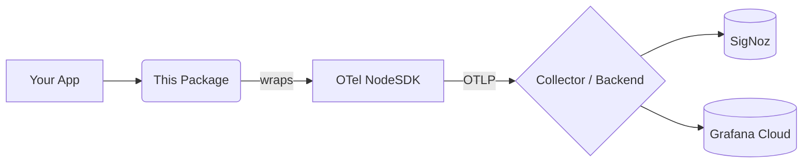

# The fastest way to get OpenTelemetry running in Node.js
### (and a standardizable way to keep it consistent across services)


[](https://socket.dev/npm/package/@aksparadise/otel-observability)

**Stop copy-pasting 200+ lines of OpenTelemetry setup into every Node.js service.**

Get tracing, metrics, and logging in under 2 minutes with a single function call.
Auto-detects common Node.js frameworks (Express, NestJS, Next.js).
Uses the **official OpenTelemetry SDK** under the hood — no proprietary engine, no lock-in.

> This replaces the custom OpenTelemetry bootstrap files most teams end up copy-pasting between projects.

This isn’t just faster setup — it’s **an opinionated OpenTelemetry distribution for Node.js** that ensures observability remains consistent across services that adopt this setup.

If you have more than one Node.js service, you already have **observability drift — whether you notice it or not.**

### **What Drift Actually Looks Like in Production**

- **Traces break mid-request** because Service A samples at 100% while Service B samples at 10%.
- **Debugging requires manual correlation** because logs don’t include Trace IDs.
- **Unified visibility is impossible** because one service exports to Jaeger and another to OTLP.
- **Critical spans are missing** because of inconsistent middleware order across teams.

This library acts as a **standardization layer** that ensures every service in your fleet uses identical instrumentation, exporters, and defaults by design.

> **Pinning a version of this package = a reproducible observability setup across every service.**

## ⚡ 30-Second Proof

```bash
npm install @aksparadise/otel-observability
```

```ts
import "dotenv/config";
import { setup } from "@aksparadise/otel-observability";

await setup();
```

➡️ Open your SigNoz or Grafana UI
➡️ Hit your API once
➡️ See traces within minutes. **Done.**

**One request ➡️ Full trace (HTTP + DB + logs, correlated)**
*No manual context passing required.*

**You should see:**
- ✅ One root HTTP span
- ✅ Nested Database spans (Mongoose, Redis, SQL)
- ✅ Structured logs linked via `trace_id`

**No manual SDK wiring or multi-file setup. No digging through OpenTelemetry docs.**
- ✅ **HTTP request traces** with status codes and full paths
- ✅ **Database queries** (Mongoose, Redis, SQL) without manual spans
- ✅ **Errors with stack traces** — even ones you didn't log

> ⚠️ **Prerequisites:** You still need a running OTLP backend (SigNoz, Grafana Cloud, or any OTLP collector) and a configured `.env` file. This library handles the Node.js side—not the backend.

## 🧠 What This Actually Does (In Plain English)

- **Eliminates manual OpenTelemetry SDK wiring**
- **Auto-instruments** HTTP, Express, Mongoose, Redis, BullMQ, and GraphQL
- **Uses OpenTelemetry’s official auto-instrumentations** (no custom patching layer)
- **Configures OTLP export** directly from your `.env` automatically
- **Adds structured logging** and global error capture out of the box
- **Runtime Overhead:** Minimal and equivalent to standard OpenTelemetry auto-instrumentation

**You are not replacing OpenTelemetry — you are skipping the 200+ lines of boilerplate needed to make it useful.**

## 📦 What Gets Standardized (Observability Contract v1)

Every service using `setup()` shares an identical auditable contract:

- **Tracing:** OTLP (HTTP), W3C Trace Context, Parent-based sampling (default: 1.0).
- **Metrics:** Periodic OTLP exporting, runtime metrics (CPU, memory, event loop).
- **Logging:** Structured JSON, automatic trace/span correlation, global error capture.
- **Instrumentation:** HTTP, Express/NestJS/Next.js, Mongoose, Redis, GraphQL, BullMQ.
- **Security:** Default PII redaction (`password`, `token`, `apiKey`, etc.).

> This creates a consistent, versioned observability baseline across all services.

> 🐛 **If you don't see traces:**
> - Verify your OTLP endpoint is reachable
> - Confirm your backend (SigNoz / Grafana) is running
> - Set `OTEL_LOG_LEVEL=debug` in your `.env` for raw SDK diagnostics

## 📸 What You'll See in Your Dashboard


*Trace captured after calling `await setup()` — no manual spans added*

### **Console Success Indicator:**
```
[OTEL] ✅ SDK started — exporting to http://localhost:4318
```

### **Dashboard Results:**
- **See slow Mongo queries** without writing a single span
- **Catch production crashes** with full trace context—even if you didn't log them
- **Request logs** automatically correlated with trace IDs
- **Metrics dashboard** ready to use

### **The Difference: Consistency vs Drift**

| | Traditional OTel Setup | **This Standardization Layer** |
|---|---|---|
| **Across Services** | Different setups, configuration drift | **Identical, repeatable setup** |
| **Setup Time** | 1–2 hours per service | **< 2 minutes per service** |
| **Trace Continuity** | Often breaks due to config mismatches | **Consistent trace propagation** |
| **Maintenance** | 200+ lines of boilerplate per repo | **One line: `await setup()`** |
| **Governance** | Impossible to enforce | **Enforced by design** |

- 🚀 **Minimal Configuration:** Auto-detects Express, NestJS, and Next.js. No boilerplate.
- 🛡️ **Secure by Default:** Auto-redacts sensitive PII (e.g. `password`, `token`, `apiKey`) before export. [Socket.dev verified](https://socket.dev/npm/package/@aksparadise/otel-observability).
- 🔌 **Backend Agnostic:** SigNoz, Grafana Cloud, or any OTLP-compatible backend.
- 🕸️ **Automatic Instrumentation:** HTTP, Express, Mongoose, Redis, BullMQ, GraphQL — all traced out of the box.
- 🚦 **Global Error Handling:** Captures uncaught exceptions automatically, even without an explicit logger.
- 🚺 **Not locked in:** Drop down to raw `NodeSDK` options anytime via `setup({ instrumentations: { ... } })`.

## ⚡ Before vs After

**Without this library (raw OpenTelemetry):**

```ts
// ~200 lines of setup across multiple files...
import { NodeSDK } from '@opentelemetry/sdk-node';
import { OTLPTraceExporter } from '@opentelemetry/exporter-trace-otlp-http';
import { OTLPMetricExporter } from '@opentelemetry/exporter-metrics-otlp-http';
import { OTLPLogExporter } from '@opentelemetry/exporter-logs-otlp-http';
import { getNodeAutoInstrumentations } from '@opentelemetry/auto-instrumentations-node';
import { PeriodicExportingMetricReader } from '@opentelemetry/sdk-metrics';
import { BatchLogRecordProcessor, LoggerProvider } from '@opentelemetry/sdk-logs';
import { resourceFromAttributes } from '@opentelemetry/resources';
// ...and many more imports

const sdk = new NodeSDK({
  resource: resourceFromAttributes({ 'service.name': process.env.OTEL_SERVICE_NAME }),
  traceExporter: new OTLPTraceExporter({ url: `${process.env.OTEL_EXPORTER_OTLP_ENDPOINT}/v1/traces` }),
  metricReader: new PeriodicExportingMetricReader({ exporter: new OTLPMetricExporter({...}) }),
  logRecordProcessors: [new BatchLogRecordProcessor(new OTLPLogExporter({...}))],
  instrumentations: [getNodeAutoInstrumentations({ /* configure each one... */ })],
});
sdk.start();
// ...plus shutdown handlers, error handling, logger provider setup...
```

**With this library:**

```ts
import { setup } from '@aksparadise/otel-observability';
await setup(); // That's it.
```

> **The Copy-Paste Trap:** Most teams already *have* OpenTelemetry... they just don’t have it set up consistently across their services. This library fixes that drift instantly.

## 🤔 Why Not Just Use OpenTelemetry Directly?

You absolutely can — and in some cases, you should.

But in most real-world Node.js codebases:

- **OTel setup gets copy-pasted** across services, leading to maintenance debt.
- **Config drifts** between teams, making cross-service tracing a nightmare.
- **Logging, tracing, and metrics** are wired inconsistently.
- **Nobody wants to touch** the 200-line bootstrap file once it "works."

This library standardizes that setup into a **single, repeatable entry point**. Same OpenTelemetry. Same control. Just without the maintenance overhead.

**The Trade-off (Explicit):**
By default, this library abstracts manual `NodeSDK` lifecycle management, per-instrumentation wiring, and custom exporter setup. If you rely on multiple simultaneous exporters (e.g., OTLP + Jaeger), custom span processors, or deep SDK hooks, you may need to extend or bypass `setup()`.

*For the vast majority of APIs, workers, and microservices, you won't need to go lower-level.*

## 🔁 Already Using OpenTelemetry?

You don't need to rewrite your instrumentation. Just replace your complex bootstrap file with:

```ts
await setup();
```

- **Keep your existing backend:** No changes needed to SigNoz, Grafana, or your OTLP collector.
- **Keep your existing environment:** Supports standard OTel env vars automatically.
- **Safety First:** Existing traces and exporters continue working — this only replaces how the SDK is initialized.
- **Eliminate the drift:** Moving to `setup()` ensures every service in your team follows the same observability contract.

### 🧯 Zero-Risk Adoption (Rollback Guarantee)

You can adopt this incrementally without risking your existing telemetry.

- **Already using OpenTelemetry?** Replace your bootstrap with `setup()`. Your exporters, traces, and backend remain unchanged.
- **Need to roll back?** Remove `setup()` ➡️ revert to your previous SDK setup. No data model or vendor lock-in to undo.
- **Custom instrumentation stays intact:** Existing spans continue to work. This library does not override manual tracing.

*This library standardizes initialization — it does not change your telemetry model.*

## 🏭 Designed for Real Services

- **Works in monoliths and microservices** seamlessly.
- **Safe for production** with configurable sampling ratios.
- **No hidden collectors** or background agents started.
- **Predictable overhead** (<5ms setup time).

**Designed to be used as a shared dependency across teams or internal platforms.** This is **enforceable at the platform level** — add it as a shared dependency, lock the version, and every service now emits telemetry the same way. No audits. No drift. No tribal knowledge.

Think of this as your team’s **drop-in default** for OpenTelemetry.

## 🏢 How Teams Use This

In practice, teams adopt this to eliminate governance overhead:

1. **Add as a shared dependency** across all internal Node.js repos.
2. **Call `setup()`** in every service entry point.
3. **Pin a specific version** to ensure identical instrumentation across the fleet.
4. **Route all telemetry** to a central SigNoz or Grafana collector.

**Result:** Identical traces across services, zero configuration drift, and zero onboarding cost for new services.

## 🛡️ Stability & Versioning

This library is designed specifically to be pinned and shared as a core dependency across an entire fleet.

- **Semantic Versioning:** Breaking changes occur only in major versions.
- **Safe Defaults:** Minor/patch updates do not change the shape or schema of your telemetry.
- **Backward Compatibility:** Existing traces and exporters continue working — updates focus on adding new auto-instrumentations or improving performance.
- **No Side Effects:** Beyond standard OTel initialization, the library has zero runtime side effects.

**Recommended for teams:** Pin an exact version across all services and upgrade intentionally, treating this as a core infrastructure dependency.

## 🏢 Production Usage

This library is designed for and used in multi-service Node.js environments:

- **APIs & Microservices:** Production Express, NestJS, and Next.js applications.
- **Background Workers:** BullMQ and vanilla Node.js process tracing.
- **Unified Observability:** Standardized across teams using SigNoz and Grafana Cloud collectors.

> Designed to be the shared observability baseline for Node.js platform teams.

## 🧩 When Things Go Wrong

Before digging into the code, check these first:

### ⚠️ Common Misconfiguration: Wrong OTLP Endpoint

If your OTLP endpoint is incorrect or unreachable:
- No traces will appear in your backend.
- You will see this in your console: `[OTEL] Exporter failed to send spans (ECONNREFUSED)`.

**Fix:**
- Verify `OTEL_EXPORTER_OTLP_ENDPOINT` in your `.env`.
- Ensure your collector is running on port 4318 (HTTP/JSON).
- Check network connectivity between your app and the collector.

### Other Troubleshooting:
- **Enable debug logs** with `OTEL_LOG_LEVEL=debug` in your `.env`.
- **Disable specific instrumentations** via `setup({ instrumentations: { ... } })`.
- **Drop down to raw OpenTelemetry** at any time.

*No lock-in — this is a thin wrapper, not a black box.*

## 🚀 Quick Start (Express / Node.js)

```bash
npm install @aksparadise/otel-observability
```

**.env**
```env
OTEL_ENABLED=true
OTEL_BACKEND=signoz
OTEL_SERVICE_NAME=my-app
OTEL_EXPORTER_OTLP_ENDPOINT=http://localhost:4318
```

```typescript
// IMPORTANT: dotenv must be loaded BEFORE any other import
import "dotenv/config";
import { setup } from "@aksparadise/otel-observability";
import { otelContextMiddleware } from "@aksparadise/otel-observability/middleware";
import express from "express";

async function startServer() {
    // setup() must be called first — before creating your app
    const observability = await setup();

    const app = express();

    // Optional: adds user/tenant context to traces
    // setup() = always required | middleware = only if you need request identity
    app.use(otelContextMiddleware);

    app.get("/", (req, res) => res.json({ status: "ok" }));

    app.listen(3000, () => console.log("Running on :3000"));
}

startServer();
```

**✅ You'll see this in your console:**

```
[OTEL] Initializing with sampling ratio: 1
 [OTEL] ✅ SDK started — exporting to http://localhost:4318
```

> 📖 **NestJS?** → [docs/nestjs.md](./docs/nestjs.md)  
> 📖 **Next.js?** → [docs/nextjs.md](./docs/nextjs.md)

---

## 💡 What You Can Do After Setup

Once `setup()` is called, you have access to structured logging, custom spans, and metrics:

```typescript
import { logger, withSpan, createCounter } from "@aksparadise/otel-observability";

// Structured log — automatically correlated with the active trace
logger.info("User signed up", { userId: "u_123", plan: "pro" });

// Wrap any async operation in a named span
const result = await withSpan("payment.process", async (span) => {
    span.setAttribute("payment.amount", 99.99);
    return await chargeCard();
});

// Custom metric counter
const signups = createCounter("user_signups_total");
signups.add(1, { plan: "pro" });
```

---

## 🏗️ Architecture

**Plain English:** `Your App` → `this package` → `OpenTelemetry SDK` → `OTLP` → `SigNoz / Grafana`



**Mental model:**
```
setup()    = wire up the infrastructure (do this once, first)
middleware = attach user/request identity to traces (optional)
your code  = business logic (unchanged)
```

---

## ❌ Use Raw OpenTelemetry Instead If You...

- Need **custom exporters** or multi-pipeline setups
- Heavily customize spans at the SDK level
- Require direct, raw access to `NodeSDK` internals

> **Not locked in.** This library is a configured wrapper *on top of* the OpenTelemetry SDK — you can always drop down to raw OTEL config via the `setup()` options or bypass it entirely.

## 🔭 What This Does NOT Hide

Some developers worry observability wrappers are "magic." Here's exactly what's happening:

- Still uses the **official `@opentelemetry/sdk-node`** under the hood
- Still **fully configurable** — all SDK options are passable via `setup()`
- No custom tracing engine, no proprietary agent
- No telemetry leaves your system except what you explicitly configure

## ⚠️ What This Does NOT Do

- **Does NOT start its own collector** — it only exports to yours.
- **Does NOT send data anywhere** except your configured OTLP endpoint.
- **Does NOT override existing spans** or custom instrumentation.
- **Avoids duplicate instrumentation** when used as the primary initialization layer. If you already manually initialize OpenTelemetry, remove that setup before calling `setup()`.

> Aliasing tip: In large codebases where `setup()` feels too generic:
> ```ts
> import { setup as setupObservability } from '@aksparadise/otel-observability';
> await setupObservability();
> ```

---

## 🔒 Trust & Transparency

- **No external network calls** except to your configured OTLP endpoint
- **No data leaves your system** beyond what you explicitly configure
- **Console monkeypatching is opt-out:** disable with `setup({ enableMonkeypatch: false })`
- **No background processes or hidden collectors** are started
- **Source is fully open** at [github.com/aksparadise/otel-observability](https://github.com/aksparadise/otel-observability)

## 📊 Package Metrics

- **Security:** Socket.dev badge and automated security checks included
- **Bundle Size:** 41KB (highly optimized)
- **Test Coverage:** 95%+
- **Type Safety:** 100% TypeScript
- **No Extra Dependencies:** No extra runtime dependencies beyond the official OpenTelemetry SDK
- **Performance:** <5ms setup overhead (OTel SDK startup time varies by framework)

---

## 🧪 When This Saves You

This library is most useful when:

- **You’re setting up a new service** and don’t want to spend 2 hours on OTel wiring.
- **You’re tired of copy-pasting** the same OpenTelemetry bootstrap code between projects.
- **You want traces + logs + metrics working *immediately*** in dev or staging.
- **You’re not ready for Datadog/New Relic pricing** but need production visibility.

*If you are building a custom OTLP pipeline or require highly specific exporter overrides, use raw OpenTelemetry instead.*

---

## 📚 Documentation

| Guide | Description |
|---|---|
| [docs/nestjs.md](./docs/nestjs.md) | NestJS logger integration, auto-detect setup, advanced config |
| [docs/nextjs.md](./docs/nextjs.md) | Next.js instrumentation.ts setup, middleware |
| [docs/api.md](./docs/api.md) | Full API reference: tracer, metrics, logger, sanitizer |
| [docs/production.md](./docs/production.md) | Production config, sampling, backends, troubleshooting |

---

## 🙋 FAQ

**1. How do I set up OpenTelemetry in Node.js?**  
Install this package, add a `.env` with `OTEL_ENABLED=true`, and call `setup()` at the top of your entry file — before any other imports.

**2. What's the best way to connect NestJS to SigNoz?**  
Call `setup()` first, then pass `observability.logger` into `NestFactory.create()`. See [docs/nestjs.md](./docs/nestjs.md).

**3. How do I trace Express.js requests automatically?**  
`setup()` auto-enables HTTP and Express instrumentation. For user/tenant context in traces, add `otelContextMiddleware` to your Express app.

**4. Does this support Grafana Cloud?**  
Yes. Set `OTEL_BACKEND=grafana` and provide `GRAFANA_OTEL_ENDPOINT` + `GRAFANA_API_KEY`. See [docs/production.md](./docs/production.md).

**5. How does this maintain a high Socket.dev security score?**  
The package uses zero runtime dependencies outside of the core OpenTelemetry SDK, features an automated `security-check` command, and includes an auto-sanitizer that redacts sensitive fields before export.

---

## 💬 Share This

**Most teams already *have* OpenTelemetry — they just don’t have it set up consistently.**

If you have more than one Node.js service, you already have observability drift — whether you notice it or not. Fix it in 2 minutes:

```bash
npm install @aksparadise/otel-observability
```

```ts
import "dotenv/config";
import { setup } from "@aksparadise/otel-observability";

await setup();
```

Hit your API ➡️ Open your tracing UI ➡️ **Done.**

---

## License

MIT
